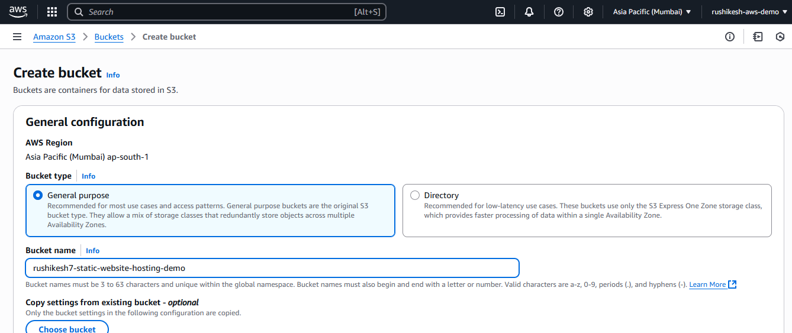

# 📦 AWS S3 Static Website Hosting – Downtime RCA Simulation

## 📝 Project Overview

This project demonstrates how to host a static website using **Amazon S3** and simulate downtime for **Root Cause Analysis (RCA)**.  
It’s part of my Cloud Support learning journey to build skills around real-world troubleshooting and cloud service handling.

---

## ⚙️ Tech Stack

- **AWS S3**
- **Static Website Hosting**
- **HTML**
- **GitHub**

---

## 🚀 Implementation Steps

### ✅ Step 1: Created HTML Files
- `index.html` – Homepage content  
- `error.html` – Custom error page for 4XX errors

📸 Screenshot: index and error HTML creation
(screenshots/.html files created.png)
---

### ✅ Step 2: Created S3 Bucket
- Bucket Name: `my-static-site-project`  
- Disabled “Block All Public Access”

📸 **
---

### ✅ Step 3: Uploaded Website Files
- Uploaded both `index.html` and `error.html` directly into the bucket

📸 *Screenshot: Upload interface*
![screenshots/Files uploading.png]
![screenshots/objects uploaded successfully.png]
---

### ✅ Step 4: Enabled Static Website Hosting
- Enabled "Static website hosting"
- Set index document: `index.html`
- Set error document: `error.html`

📸 *Screenshot: Static website hosting enabled*
![screenshots/Successfully SWH enabled_1.png]
![screenshots/Successfully SWH enabled_2.png]
---

### ✅ Step 5: Updated Bucket Policy
- Granted public `GetObject` permission using a bucket policy

📸 *Screenshot: Policy editor with JSON*
![screenshots/check Block Public access On or Off.png]
![screenshots/Bucket policy successfully edited..png]
---

### ✅ Step 6: Tested Website URL
- Opened S3 endpoint in browser
- Website loaded successfully  
👉 `http://<your-bucket-name>.s3-website-<region>.amazonaws.com`

📸 *Screenshot: Working website*
![screenshots/Endpoint URL initial result- Access Denied.png]
![screenshots/Endpoin URL result after enabling public access.png]
---

## ⚠️ Simulated Downtime for RCA

### 🧪 Scenario
- Manually removed public access / deleted `index.html`
- Tried accessing the site via public URL
  
📸 *Screenshot: object renamed*
screenshots/Object renamed successfully.png

### 🔍 Observed
- HTTP 403 or 404 errors
- Custom error page shown as expected
  
📸 *Screenshot: error page observed*
screenshots/Showing error page.png

### 📋 RCA Report

| **Component** | **Cause**                         | **Resolution**                         |
|---------------|-----------------------------------|----------------------------------------|
| S3 Bucket     | File deleted / Access blocked     | Re-uploaded file / Updated policy      |
| Public Access | Misconfigured policy or blocked   | Reviewed and updated bucket permissions |
| Hosting Setup | Missing or wrong config           | Validated index & error document setup |

📸 *Screenshot: Error screen and resolution*
screenshots/Showing error page.png
screenshots/Missing file restored.png
screenshots/Website back to online.png
---

## 📚 Learnings

- Hosting a static site on AWS S3
- Importance of public access configuration
- Using error documents to simulate real downtime
- Writing an RCA report like a cloud support engineer

---

## 🔮 What’s Next?

- Add CloudWatch logging for request tracking
- Automate setup with Terraform
- Monitor site health using AWS Route 53 or Lambda Alerts

---

## 🤝 Connect with Me

If you're interested in collaborating on Cloud Security or Support projects, feel free to connect!

📂 **GitHub Repo**: [repo-link-here]  
🧑‍💻 **LinkedIn**: [www.linkedin.com/in/rushikeshvastre]
